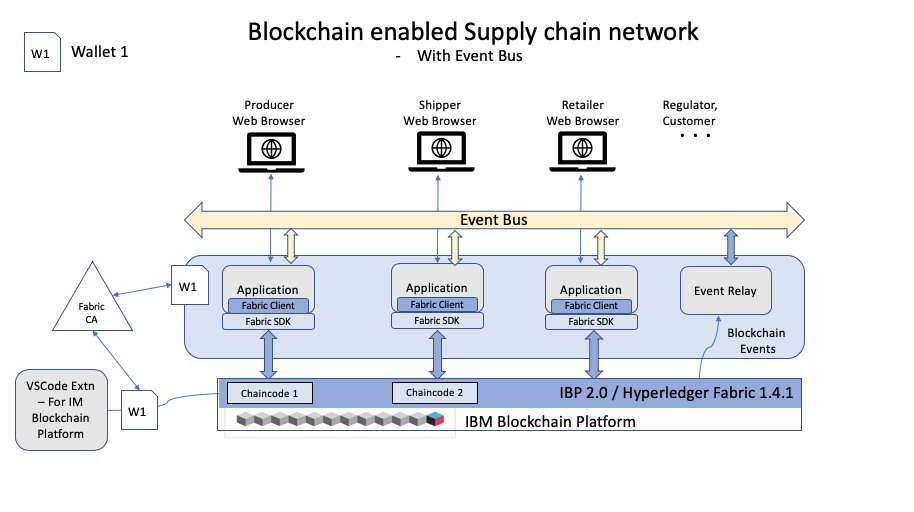

> This repository will be updated. I will review the pull request and merge it when needed.

# Implement attribute-based access control to provide end to end visibility into the supply chain history of a particular product

This sample demonstrates an end to end blockchain application that connects to Hyperledger Fabric 1.4 or the IBM Blockchain Platform. It implements attribute-based access control, user management, and an Angular front-end UI to interact and query the blockchain ledger. The sample takes the user through ordering, shipping, and enlisting the customer to purchase. The customer can trace the order history through the supply chain, providing end to end visibility. For example, in the video above, you can see the retailer receiving a shipment and then a customer logging into the application to see a trace of when the shipment was ordered, shipped, and received. Lastly, a regulator has access to all orders in the system to ensure
correct practices are followed.

**Audience level: Intermediate Developers**

### Permissioned blockchains - enabling transparency and confidentiality

In the supply chain, confidentiality is mandatory since some consumers might be given discounted rates compared to others. In this scenario, other consumers should not be able to access their competitors' rates. Given that Hyperledger Fabric is optimized for a broad range of industry use-cases, including supply chain, the open-source framework provides a way to implement confidentiality at the chaincode layer using attribute-based access control. This example shows you
how to implement such functionality by registering and enrolling each user with a specific attribute, called "usertype".
To jump to the code that does this, go [here](https://github.com/IBM/fabric-contract-attribute-based-access-control/blob/master/application/server/utils.js#L220);
The "usertype" can be **admin**, **regulator**, **producer**, **shipper**, **retailer**, or **customer**. When that user logs in
successfully and connects to an instance of the Hyperledger Fabric network, their "usertype" gives them access to certain transactions that have been submitted on the network. For example,
the **regulator** (such as the FDA) can view all transactions on the network to reliably audit
the network. Still, a **retailer** can only access assets and invoke transactions against assets they are involved in. Once you
understand how to apply these access control rules, you can apply them to any use case and start building innovative, secure blockchain networks.

When the reader has completed this code pattern, they will understand how to:

1. Implement attribute-based access control in Hyperledger Fabric
2. Build a chaincode in which specific users have access to specific transactions
3. Use an Angular UI to interact with a Hyperleder Fabric network.

## Application Access Control Rules, Architecture, and Model can be found [here](https://github.com/IBM/fabric-contract-attribute-based-access-control/blob/master/app-architecture.md)

## Architecture Diagram

## Flow Diagram

## Flow Description

1. The user interacts with an Angular Web UI to update and query the blockchain ledger and state
2. The UI calls Node.js application APIs running on a backend server
3. The Node.js application server calls Fabric SDK APIs [see documentation here](https://hyperledger.github.io/fabric-sdk-node/release-1.4/index.html)
4. The Fabric SDK interacts with and submits transactions to a deployed IBM Blockchain Platform 2.0 or a Hyperledger Fabric 1.4.1 network

The value of running this network on the IBM Blockchain Platform is that one can easily customize the network infrastructure as needed, whether that is the location of the nodes, the CPU and RAM of the hardware, the endorsement policy needed to reach consensus, or adding new organizations and members to the network.

# Included components

- [IBM Blockchain Platform Extension for VS Code](https://marketplace.visualstudio.com/items?itemName=IBMBlockchain.ibm-blockchain-platform) is designed to assist users in developing, testing, and deploying intelligent contracts -- including connecting to Hyperledger Fabric environments.

## Featured technologies

- [Hyperledger Fabric v1.4](https://hyperledger-fabric.readthedocs.io) is a platform for distributed ledger solutions underpinned by a modular architecture that delivers high degrees of confidentiality, resiliency, flexibility, and scalability.
- [Node.js](https://nodejs.org) is an open-source, cross-platform JavaScript run-time environment that executes server-side JavaScript code.
- [Angular](https://angular.io/) Angular is a platform for building mobile and desktop web applications.

## Helpful links

https://cloud.ibm.com/docs/containers?topic=containers-getting-started

https://hyperledger.github.io/fabric-sdk-node/release-1.4/

https://hyperledger.github.io/fabric-sdk-node/release-1.4/module-fabric-network.html

https://marketplace.visualstudio.com/items?itemName=IBMBlockchain.ibm-blockchain-platform

https://cloud.ibm.com/docs/services/blockchain/howto?topic=blockchain-ibp-console-build-network#ibp-console-build-network

## Contributers

Sowmya Janakiraman

Ann Umberhocker

Kaleen Iwema

## License

This code pattern is licensed under the Apache Software License, Version 2. Their respective provider's licenses separate third-party code objects invoked within this code pattern according to their separate licenses. Contributions are subject to the [Developer Certificate of Origin, Version 1.1 (DCO)](https://developercertificate.org/) and the [Apache Software License, Version 2](http://www.apache.org/licenses/LICENSE-2.0.txt).

[Apache Software License (ASL) FAQ](http://www.apache.org/foundation/license-faq.html#WhatDoesItMEAN)
